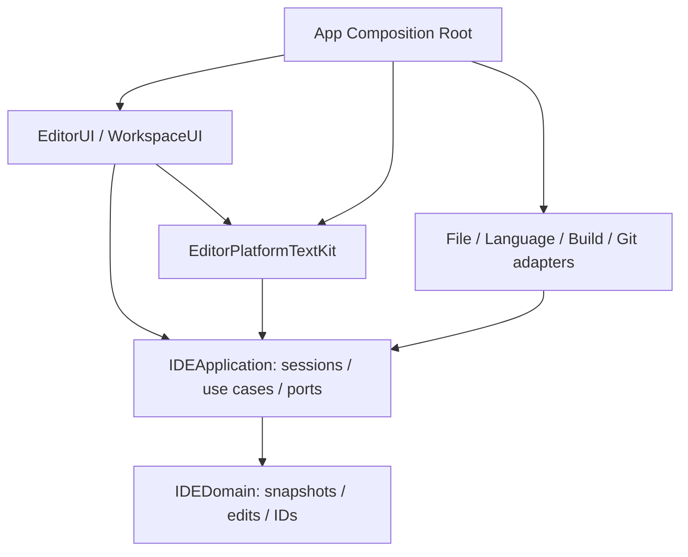

# Clean Architecture: TextKit 2 and a replaceable backend

## Current choice

The first version uses NSTextView on TextKit 2. Clean Architecture and DI are kept: the application layer does not depend on NSTextStorage, layout fragments or NSUndoManager. A custom engine is the next possible backend implementation, not a dependency of the first delivery.

Arrows are compile-time imports. The UI may depend on the platform adapter to create a native view; the application works only with the port. The Composition Root chooses the implementation. There are no cycles.

## Modules

| Module | Responsibility | Dependencies |
|---|---|---|
| IDEDomain | IDs, snapshots, UTF-16 edits, change sets, metadata | Standard library / Foundation values |
| IDEApplication | Sessions, versions, save policy, use cases, backend and I/O ports | IDEDomain |
| EditorPlatformTextKit | TextKit storage/layout graph, the future native editing/undo bridge | IDEApplication, IDEDomain, AppKit |
| EditorUI | Editor host, gutter, completion, decorations, commands | IDEApplication, EditorPlatformTextKit, AppKit |
| WorkspaceUI | Project tree, tabs, Problems, palette | IDEApplication, IDEDomain, AppKit/SwiftUI |
| FileSystemInfrastructure | Read/write/watch, recovery, disk revisions | IDEApplication, IDEDomain, Foundation |
| LanguageInfrastructure | Ordered JSON-RPC, SourceKit, DTO/position mapping | IDEApplication, IDEDomain |
| XcodeInfrastructure | Toolchain/project discovery, BSP configuration | IDEApplication, IDEDomain, ProcessInfrastructure |
| BuildInfrastructure / GitInfrastructure | Tool adapters | IDEApplication, IDEDomain, ProcessInfrastructure |
| ProcessInfrastructure | Launch, streams, cancel/termination | Foundation |
| SwiftIDEApp | Composition Root, windows, lifecycle | The UI and the concrete implementations |

At the start there are 5–6 SPM targets, then a split along real boundaries. The current example combines the memory file store and the String backend in IDEInfrastructure. EditorCore/EditorLayout/EditorRendering are not part of the mandatory MVP graph.

## A single owner of the text

DocumentSession receives `any DocumentEditingBackend` in its initializer. It keeps id/path/version/savedVersion and the subscribers; `text` is a computed read of the backend. A mutable String is not kept next to NSTextStorage.

The backend holds the only mutable storage. An immutable snapshot and a temporary staged edit plan are allowed: they are not a second editable model. The current example explicitly uses O(n) snapshots/planner; production optimization is determined by measurements.

The application port: an immutable text read + a synchronous commit of a prevalidated plan. `apply(edits:expectedVersion:)` belongs to the session and checks for a stale version, ranges, surrogate boundaries, overlaps and no-ops. After a successful commit the version increases once and a ChangeSet is published.

This is the programmatic editing contract v0.1. Connecting a native NSTextView requires extending the transaction bridge, as described in the [TextKit plan](08_TEXTKIT_IMPLEMENTATION_PLAN.md). Exposing a mutable NSTextStorage and treating arbitrary callbacks as transactions is not allowed.

## State ownership and lifetime

| State | Owner | Lifetime |
|---|---|---|
| Settings / toolchain catalog | AppScope | The application |
| Registry, language/build sessions | WorkspaceScope | The workspace |
| Text storage / content manager | Document backend | DocumentSession |
| Version, saved disk revision, subscriptions | DocumentSession | The document |
| Selection, viewport, gutter, completion UI | EditorSession/native view | The editor view |
| Native undo groups | Document-scoped UndoCoordinator + NSUndoManager adapter | The document |
| Marked text composition | Native input bridge / editor view | The IME session |
| Search/completion tasks | Feature request | Until completion/cancel |

In the first alpha there is one writable editor per document. Split editor is postponed until the shared backend, independent selections and shared history are verified. A later factory must take the session from the registry; the current demo factory creates one session and does not implement a registry.

One document must not have independent writable copies in different workspaces. For multiple windows, first reuse the workspace scope; cross-workspace editing requires an application-wide identity registry and LSP fan-out.

## Events

One commit → one typed event to all active subscribers. The current example uses synchronous MainActor subscriptions with an explicit unsubscribe. A callback quickly puts the work on its own queue; a new text edit during publication is rejected so that versions are not reordered for the other subscribers.

If an observer holds the session, capture the session weakly or drop the subscription on close. A subscription snapshot during publication means: cancelling another callback takes effect from the next event. A global EventBus is not needed.

For future async subscribers there is a separate queue per consumer. A single AsyncStream is not a broadcast. Layout invalidations can be merged; losing LSP changes requires a resync. Generation and version are checked after every await.

## Concurrency and boundaries

Session, backend and native view are MainActor. Snapshots are independent Sendable values. Parsing, search, I/O and external processes receive snapshots and work off the UI executor; async by itself does not move blocking I/O to the background.

AppKit objects are not declared unchecked Sendable. Domain/Application do not import AppKit. Save, LSP and recovery do not receive NSAttributedString, NSTextLocation or mutable storage.

DI through constructors and factories; concrete types stay concrete inside the adapter. A service locator, a generic repository for everything and a universal Shared are not needed.

## Document language and mixed projects

The target contract ([ADR-021](07_ARCHITECTURE_DECISIONS.md#adr-021-support-for-the-languages-of-a-mixed-swift-project)): the language identifier is a value in Domain; the effective language, the source of the choice and the revision of the language context belong to the document session in Application. Highlighting, LSP and commands use this shared choice. Grammars/queries stay in SyntaxInfrastructure, LSP language IDs and capabilities in LanguageInfrastructure, target and build settings in the workspace/project adapters. Changing the language is not a text edit, but it cancels requests and invalidates the results of the old context. This is implemented for highlighting (Swift, C, C++, Objective-C) and for the SourceKit-LSP language features of Swift and the C family; the target context of the build is still to come (TK-018). Details: [mixed-project support](12_MIXED_LANGUAGE_SUPPORT.md).

## Project context

The target contract of TK-018 ([ADR-023](07_ARCHITECTURE_DECISIONS.md#adr-023-support-for-bazel-projects)): the Application/workspace scope owns the selected project type, root, targets/config, tools and the context revision; identifiers and values do not depend on the CLI or on BSP JSON. The document language and the project type are independent. SwiftPM, Xcode/BSP, Bazel and a compilation database are connected through concrete project/build adapters; LanguageInfrastructure uses the selected context. An explicit workspace takes priority over a nested `Package.swift`; a change of targets/config/toolchain invalidates old requests and diagnostics. One selected context shares a service between documents and is responsible for terminating the processes it owns. Routing is currently implemented only for SwiftPM and for the shared service of single files. Details: [Bazel plan](13_BAZEL_SUPPORT.md).

## Chat and agent plan

The plan for chat/agent features keeps the same boundaries: AgentSession and CodingAgentProvider in Application, provider-specific CLI/SDK adapters outside, ChatUI through use cases. The agent receives snapshots and applies edits through the versioned document workflow. These modules are not implemented yet; [integration plan](09_CLAUDE_AGENT_INTEGRATION.md).

## Moving to a custom engine

The ground for moving: a reproducible failure of the agreed latency/memory/functionality budget that cannot be acceptably fixed in the TextKit adapter. Then a new backend and UI bridge are designed; selections/undo/composition/layout will require migration work.

The current PreparedDocumentEdit contains full strings and is not the optimal contract for a Piece Tree. In such a migration the preparation must become backend-specific (an immutable plan/token), keeping the public edit/version/event semantics. Saving, the workspace and the language services must not depend on this optimization.
