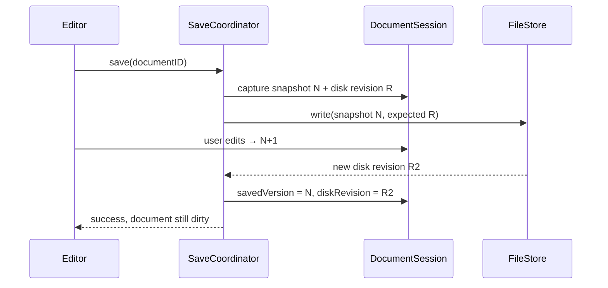

# Engine contracts and the main workflows

The current backend is TextKit 2. The custom engine in the original document is a historical algorithmic variant. Below is the production design; the programmatic and native transaction bridge and the save gate are already implemented in Packages/IDE; the real file store (open/save, recovery, watching) is implemented as well, see ADR-011, ADR-016 and ADR-017.

## Document transaction

```text
EditTransaction
  documentID / expectedVersion
  transactionID
  edits: UTF16TextRange + replacement, in one source version
  origin: command | typing | composition | undo | redo | formatting | languageAction

ChangeSet
  documentID / oldVersion / newVersion
  transactionID
  canonical edits in old coordinates, descending order
  origin
```

Public ranges are half-open UTF-16. The backend adapter converts them to native types. LSP needs line/character rather than an absolute offset: a line index with CRLF and conversion relative to the source snapshot is required. A future Piece Tree may keep UTF-8 internally, inside its own adapter.

An empty/no-op transaction does not change the version. Byte equality preserves the difference between Unicode normalizations. All ranges, surrogate boundaries and overlaps are checked before the commit. Insertions at the same position are rejected in v0.1 as ambiguous. Machine edits do not split a scalar; user navigation stays grapheme-aware.

DocumentSession does not keep a separate editable copy of the string: the text belongs to the backend. Before the commit expectedVersion is checked; then the commit is synchronous, the version is bumped once, and the event goes to all subscribers. A reentrant edit during publication is rejected. An observer queues its work and does not block the UI.

The current planner prepares a new String before the commit and spends O(n) memory/time. The TextKit backend applies validated edits from the end inside beginEditing/endEditing. This is an architecture prototype, not a performance solution for 100 MB.

A snapshot is an independent Sendable String + documentID/version/path. A mutable NSTextStorage/NSAttributedString cannot be a snapshot. The memory budget accounts for simultaneous snapshots, parsing requests and native undo. Encoding/BOM/line endings are production metadata, not yet implemented in the example.

## Native NSTextView editing

Native input, paste, undo/redo and IME must enter one transaction bridge. The NSTextStorage delegate distinguishes text and attribute changes, but a callback after processing does not replace a journal of the original edits. The original state/plan must be captured before the change, and a correct batch published after a successful native commit.

For TK-005 pre-validation was chosen, with refusal before mutation for known violations. An unexpected native mutation that has already happened is accepted through before/after reconciliation, without a repeated backend.commit and without a rollback in the storage delegate. The transaction ID joins the callbacks of one operation; the version/event are published exactly once when the text changes. This is an extension of the current commit-only port, not yet implemented in the code.

Attribute-only syntax/diagnostic updates do not change the text version and do not go to LSP. Every composition step that changes text is published with `.composition` and a new version; LSP is synchronized with the current backend, marked text included. End/cancel of a composition is passed separately from text events, including when there is no text change. Completion/format edits wait for the composition to end and for the version/context to be checked again.

The native undo history is not duplicated by a second application stack. Programmatic format/LSP edits use the same bridge and register undo. One undo group may contain several text revisions; these are different concepts. Details and stages: [TextKit implementation plan](08_TEXTKIT_IMPLEMENTATION_PLAN.md).

## Opening a file

1. Resolve the file identity and access; check the registry, and return an already open document as the existing one.
2. Read in the background with a size limit; detect binary/encoding and keep the disk revision.
3. Decode without silently replacing invalid bytes. The first release handles UTF-8/UTF-8 BOM; unsupported encodings are an explicit error or a read-only preview.
4. Create TextKitDocumentBackend, inject it into DocumentSession, create the EditorSession/native view and show the text without waiting for LSP.
5. Create separate syntax/recovery/LSP/watcher subscriptions and put `didOpen` into the ordered transport.
6. Cancelling the open or closing the workspace invalidates a late result.

Line endings, BOM and encoding are save metadata. Mixed line endings are kept in the text; a normalization command is separate and undoable. Binary detection must not accept valid UTF-8 merely because of the `.swift` extension.

## Saving



Writes of one document are serialized. A repeated save is queued/merged with the last request; the demonstration code simplistically returns `saveInProgress`. Different documents may be saved at the same time. On an error the saved marker does not change.

Before capturing the snapshot an explicit Save ends the active composition through the native bridge; if that is not yet possible, it waits for end/cancel. Autosave waits without forcing the end. The current state after the transaction has finished is captured, not the old pre-composition text. The gate is implemented in `SaveDocumentUseCase` (`SaveTrigger`); the detailed contract is in the [TextKit plan](08_TEXTKIT_IMPLEMENTATION_PLAN.md#3-undo-and-ime). Dirty is currently determined by comparing version/savedVersion: undoing to the saved text increases the version and does not clear dirty.

The production port accepts the expected disk revision and returns a new one. Before the replacement it checks for external changes; the temp file is created on the same volume, and the write and atomic replacement take permissions, extended attributes, the symlink policy and cleanup into account. Atomic replacement alone does not guarantee durability on power loss; such a guarantee must be implemented and verified separately.

Checking the revision + replace without coordination has a TOCTOU window. FileCoordinator/available OS mechanisms and a test with a concurrent external writer are part of the save spike; we do not promise a universal filesystem compare-and-swap. A conflict offers diff/reload/save copy; a forced overwrite is an explicit action.

Recovery keeps a journal/checkpoint independently of the file. Restore compares the disk revision and shows discrepancies. The IDE's project metadata is in app support; writing the BSP configuration into the workspace is visible to the user.

## LSP and versions

We choose UTF-16 for the first client. LSP 3.17 allows encoding negotiation; no choice means UTF-16. The encoding is fixed per session, and the conversion is done in one adapter. [The initialize contract](https://raw.githubusercontent.com/microsoft/language-server-protocol/gh-pages/_specifications/lsp/3.17/general/initialize.md).

`contentChanges` inside `didChange` are applied sequentially. Our edits are given in one source version: for non-overlapping replacements we send them in descending position order, converting ranges through the source snapshot; edits to the left stay correct after edits to the right. In the current contract coinciding positions are rejected; a possible future normalization must be deterministic. When in doubt, full sync is used only if the server declared the corresponding support. Completion is sent after the preceding changes have been written to the same ordered transport. [The didChange contract](https://raw.githubusercontent.com/microsoft/language-server-protocol/gh-pages/_specifications/lsp/3.17/textDocument/didChange.md).

One producer/queue per session with per-document ordering is needed. Simply creating an independent `Task` for each event and calling an actor is not enough. The queue keeps sequence numbers; an overflow/restart leads to a controlled reopen/resync, not to a lost change.

Request context: documentID + documentVersion + editorID + caret/query revision + workspace generation. If the text or the cursor changed, a completion response may be stale even with the same request method. Cancellation reduces work; the context check guarantees correctness when a response is late.

A planned extension per [ADR-021](07_ARCHITECTURE_DECISIONS.md#adr-021-support-for-the-languages-of-a-mixed-swift-project): the context also includes the revision of the language choice and of the target settings. Changing the language without a text edit invalidates requests/diagnostics and reopens the LSP document when `languageId` changes. Highlighting and LSP use the shared document language; the root and build settings are determined from the project context, not by a single `.swift` check. Details: [mixed projects](12_MIXED_LANGUAGE_SUPPORT.md).

Diagnostics with a version are shown only for the current version. For unversioned notifications there is no proof of freshness: show them as unverified, or clear them after an edit and wait for a new set; do not apply automatic fix edits without checking. Do not invent a server version from the time a message was received.

An LSP failure: the text keeps working; pending requests finish with an error, the session gets a new generation, and it restarts with a bounded backoff and a repeated didOpen of the current snapshots. Capabilities are updated after initialize.

The TK-018/020 plan per [ADR-023](07_ARCHITECTURE_DECISIONS.md#adr-023-support-for-bazel-projects): the project context sets the project type, the root, targets/config and the selected tools. For Bazel we check a ready `.bsp/skbsp.json` and `.sourcekit-lsp/config.json`, the project path to LSP and the preparation/indexing state. Changing the context cancels work and prevents old responses from being applied when the text is unchanged. BSP is launched through SourceKit-LSP; closing the scope terminates the processes it owns. The shared language choice of TK-015 stays independent. [Scope and criteria](13_BAZEL_SUPPORT.md).

## Format / workspace edit

Format captures snapshot N, receives edits in N, checks the current version and applies one undoable transaction. If the user kept typing, the result is discarded or a retry is offered, with no silent overwrite.

A cross-file rename is harder than a document transaction: it needs a preview, a preflight of all versions/accesses, staging, a recovery manifest and a rollback policy. Atomicity across all files on disk is not guaranteed by ordinary file APIs. Until that milestone, rename is limited to a verified single document or switched off.

## Build / Run

`BuildRequest` contains the workspace, scheme/target, configuration, destination, toolchain, generation and save policy. The default is to save dirty documents before a build; an unsuccessful save stops the build. The build adapter receives a value request and builds an arguments array without shell interpolation.

The process runner reads stdout/stderr independently, does not block the UI when pipes fill, delivers a bounded event stream and supports cancelling the process and its child processes. Exit code and diagnostics are different fields of the result. stdout/stderr/tool logs are not instructions for the IDE.

Run is a separate scenario after a successful build: resolve the artifact/destination, install the application and launch it. For an early milestone, a build and a simulator run of one fixture is enough; physical devices, signing UI and the debugger are postponed.
